# Digital Innovation One - Primeiros passos com .NET + C#

https://web.digitalinnovation.one/course/primeiros-passos-com-net-c

Nesse curso o aluno terá o primeiro contato com a plataforma .NET e sua linguagem C# aprendendo onde e como utilizá-las. O especialista vai mostrar como preparar ambiente, lidar com erros, classes e objetos.

## <a name="indice">Índice</a>

1. [O que é .NET?](#parte1)     
2. [Iniciando com .NET](#parte2)     
3. [Conhecendo o C#](#parte3)     
4. [Conhecendo variáveis e instruções](#parte4)     
5. [Classes e objetos essenciais em C#](#parte5)     
6. [Trabalhando com structs, interfaces e enums](#parte6)     
7. [Uma síntese do que é .NET](#parte7)     
---


## <a name="parte1">1 - O que é .NET?</a>

- Conhecendo o framework
- Como e aonde usar .NET
- Certifique seu conhecimento

```
Em qual década a Microsoft foi criada?
1980
1970
1960
1950
1990

R: 1970
```

```
Qual é a ordem correta de atuação de cada componente dentro do .NET?
Nenhuma das alternativas.
Código Fonte > Compilador da linguagem > Linguagem Intermediária > CLR > Linguagem de Máquina
Código Fonte > CLR > Linguagem de Máquina
Código Fonte > CLR > Linguagem Intermediária > Compilador da linguagem > Linguagem de Máquina
Linguagem de Máquina > CLR > Linguagem Intermediária > Compilador da linguagem > Código Fonte

R: Código Fonte > Compilador da linguagem > Linguagem Intermediária > CLR > Linguagem de Máquina
```

```
Qual dos fatos a seguir não é verdadeiro?
Em 2014 o empresário Satya Nadella compra a Microsoft e se torna sócio majoritário da empresa.
O C# 1.0 foi lançado em 2002.
O .NET 1.0 foi lançado em 2000.
Em 2010 a Microsoft lança comercialmente o Windows Azure.
O Roslyn é um novo compilador C# criado a partir de 2013.

R: Em 2014 o empresário Satya Nadella compra a Microsoft e se torna sócio majoritário da empresa.
```

```
O que acontece a partir de 2020 com relação ao .NET?
O .NET Framework deixará de ser evoluido, mantendo-se a evolução apenas do .NET Core, que passará se chamar apenas .NET.
A Microsoft irá criar uma nova implementação open source e multiplataforma.
A Microsoft irá vender seus códigos para a Oracle.
Todas as alternativas estão corretas.
VB.NET passará a ser a única versão suportada na plataforma.

R: O .NET Framework deixará de ser evoluido, mantendo-se a evolução apenas do .NET Core, que passará se chamar apenas .NET.
```

```
O que era o projeto Mono criado por Miguel de Icaza em 2001?
Uma nova implementação do Java, focado em Windows.
Uma nova linguagem de programação.
Um projeto para elaboração de monografias.
Uma reimplementação do .NET patrocinado pela Microsoft, que viria a se chamar .NET Core.
Uma reimplementação black box do .NET, criado de forma independente por ele com foco em ser open source e multiplataforma.

R: Uma reimplementação black box do .NET, criado de forma independente por ele com foco em ser open source e multiplataforma.
```

```
O .NET Core é uma implementação open source e multiplataforma do .NET Standard. Qual dos itens abaixo é uma das outras implementações?
.NET Framework
C#
.NET Forever
CLR
Mini .NET

R: .NET Framework
```

```
Qual o foco da Microsoft a partir de 2014?
Sistemas Operacionais Linux.
Docker.
Sistemas Operacionais Windows
Java.
Cloud.

R: Cloud.
```

```
Em 1999, Jason Zander ajudou na criação de um CLR. Qual o significado de CLR?
Common Language Reactive
Converter Language Runtime
Common Literal Runtime
Cascade Language Runtime
Common Language Runtime

R: Common Language Runtime
```

```
Em qual ano surgiu a primeira versão do Visual Studio?
2002
1970
1995
1997
2000

R; 1997
```

```
Qual linguagem de programação começou a ser criada pela Microsoft em 1999 com ajuda de Anders Hejlsberg?
FoxPro
Visual Basic
C#
F#
C++

R: C#
```


[Voltar ao Índice](#indice)

---


## <a name="parte2">2 - Iniciando com .NET</a>

- Preparando o ambiente
- Conhecendo a CLI do .NET
- Criando uma aplicação console
- Certifique seu conhecimento

```
Qual o comando para criar uma aplicação console via CLI do .NET com o nome 'Teste'?
dotnet new console -n Teste
dotnet build Teste
dotnet new console Teste
dotnet new Teste
dotnet new -h

R: dotnet new console -n Teste
```

```
O que faz o comando 'dotnet restore' na CLI do .NET?
Restaura os pacotes e dependências do projeto.
Executa a aplicação.
Publica a aplicação.
Cria um novo projeto.
Compila o código fonte e gera as DLL's.

R: Restaura os pacotes e dependências do projeto.

```

```
Qual é o comando da CLI do .NET para compilar o código fonte e gerar as DLL's?
dotnet build
dotnet run
Nenhuma das alternativas.
dontet --help
dotnet restore

R: dotnet build
```

```
O que significa CLI?
Common Literal Interface
Command Line Interface
Command Line Interactive
Common Language Intermediate
C# Language Interpreter

R: Command Line Interface
```

```
Qual dos itens abaixo não compõe o pacote de instalação do .NET SDK?
Bibliotecas de Desenvolvimento
CLI
C#
CLR
Visual Studio Code

R: Visual Studio Code
```

```
Qual dos itens abaixo é uma opção multiplataforma para edição/criação do meu código fonte em .NET?
Todas as alternativas são corretas.
Visual Studio Code.
Visual Studio.
Word.
Visual Studio for Mac.

R: Visual Studio Code.
```

```
Qual dos itens abaixo é necessário ter instalado na máquina para desenvolver aplicações .NET?
.NET SDK
Java
Nuget
Nenhuma das alternativas.
.NET Runtime

R: .NET SDK
```

```
O que é uma aplicação console?
Uma aplicação que depende do windows para ser executada.
Uma aplicação que é executada em um terminal.
Uma aplicação para trabalhar com chamadas HTTP Restful.
Uma aplicação que roda na web.
Todas as alternativas estão corretas.

R: Uma aplicação que é executada em um terminal.
```

```
Qual o comando para rodar uma aplicação .NET via CLI?
dotnet restore
dotnet new
dotnet build
dotnet run
dotnte publish

R: dotnet run
```

```
Qual o comando parâmetro para visualizar a documentação de ajuda da CLI do .NET?
--info
--help
build
new
--version

R: --help
```

[Voltar ao Índice](#indice)

---


## <a name="parte3">3 - Conhecendo o C#</a>

### O que é e como funciona o C#

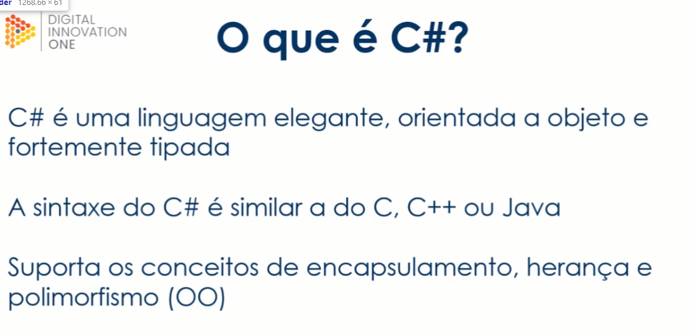

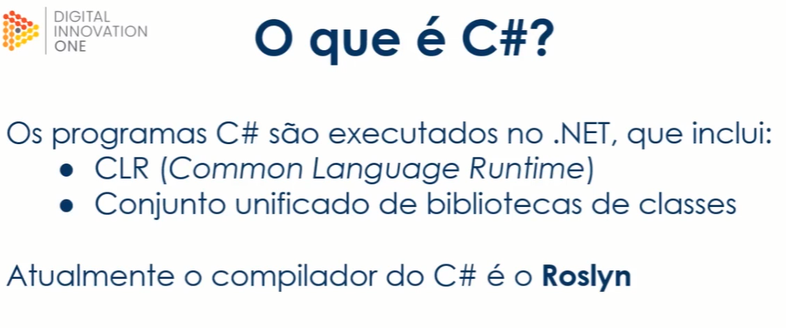

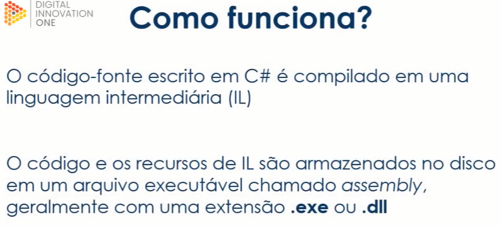

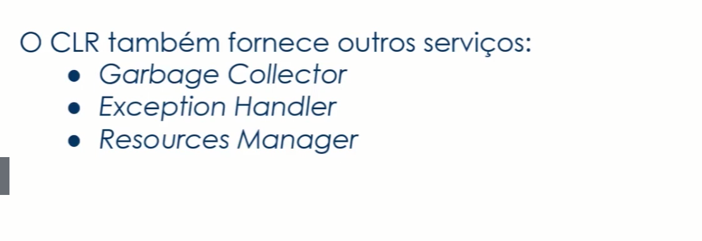

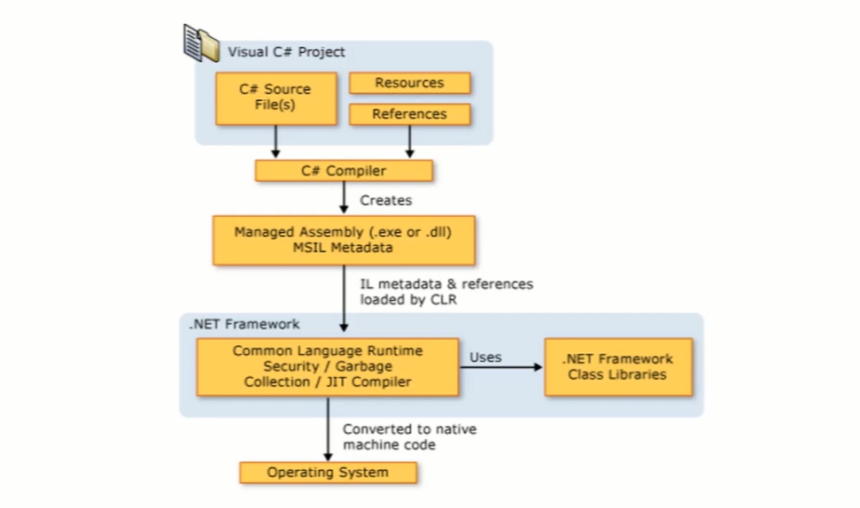

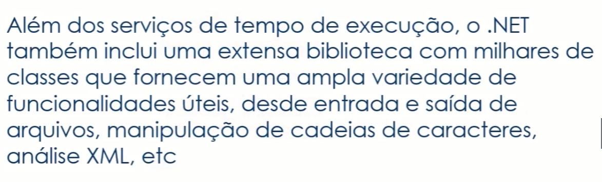


### Estrutura do programa

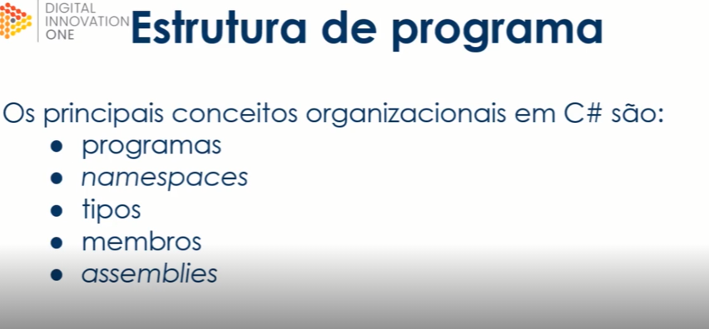

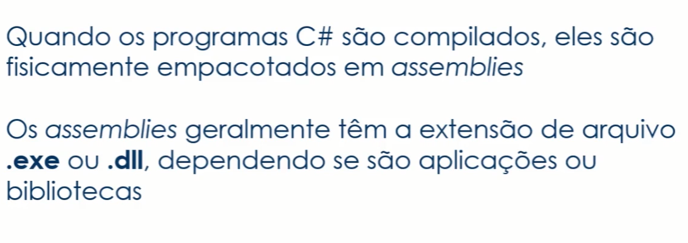


[Códigos Demonstrados - mod03\solution](mod03/solution)

Questões

```
Qual dos itens a seguir é parte da estrutura de um programa C#?
Assemblies
Tipos
Membros
Namespaces
Todas as alternativas estão corretas.

R: Todas as alternativas estão corretas.
```

```
O código e os recursos de Linguagem Intermediária são armazenados no disco em um arquivo executável chamado:
C#
Assembly
Todas as alternativas estão corretas.
CLR
IL

R: Assembly
```

```
Qual dos itens a seguir é exemplo de tipo?
Campos
Métodos.
Classe.
Propriedades.
Todas as alternativas estão corretas.

R: Classe.
```

```
Qual o nome da compilação para converter o código de Linguagem Intermediária em instruções de máquina nativas?
build
Runtime
dll
CLR
JIT (Just in Time)

R: JIT (Just in Time)
```

```
O que um código C# gera ao ser compilado no comando "dotnet build"?
Nenhuma das alternativas.
Código compilado em Linguagem Intermediária.
Código CLR.
Código compilado em Linguagem de Máquina.
Código JIT.

R: Código compilado em Linguagem Intermediária.
```

```
Qual é a função do Garbage Collector?
Converter código compilado em Linguagem de Máquina.
Limpar objetos não utilizados da memória.
Restaurar os pacotes e dependências do projeto.
Converter código compilado em Linguagem Intermediária.
Gerenciar as exceptions da aplicação.

R: Limpar objetos não utilizados da memória.
```

```
Quem converte os assemblies em Linguagem de Máquina?
CLR
CLI
C#
Bibliotecas de Desenvolvimento
Visual Studio Code

R: CLR
```

```
Os assemblies gerados na compilação do C# geralmente possuem qual extensão?
.exe ou .dll
.jar
.cs ou .csproj
.sln
.doc

R: .exe ou .dll
```

```
Quando os programas C# são compilados, eles são fisicamente empacotados em:
Classes.
Assemblies.
Nenhuma das alternativas está correta.
Interfaces.
Campos.

R: Assemblies.
```

```
Qual dos itens a seguir é exemplo de membro?
Todas as alternativas estão corretas.
Assemblies.
Campos.
Interfaces.
Classe.

R: Campos.
```


[Voltar ao Índice](#indice)

---


## <a name="parte4">4 - Conhecendo variáveis e instruções</a>

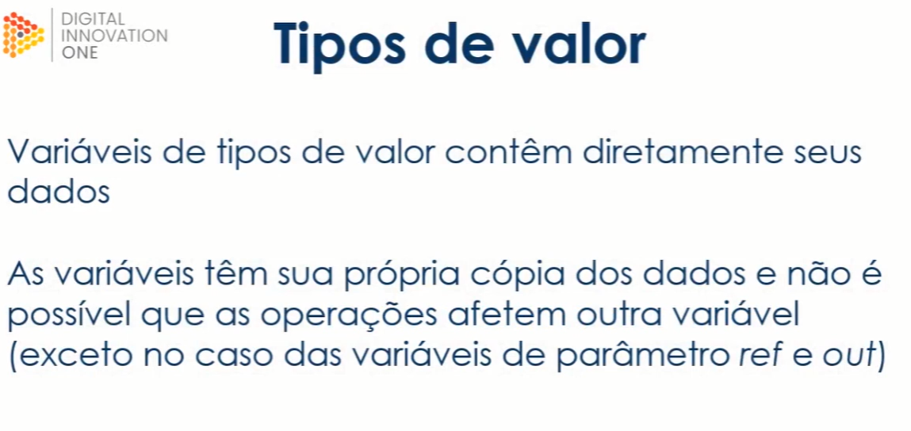

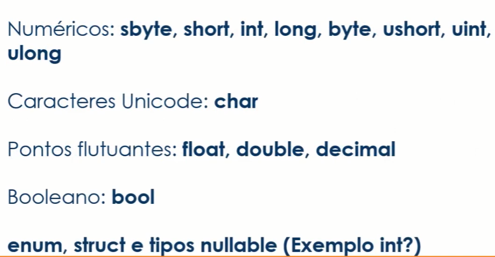

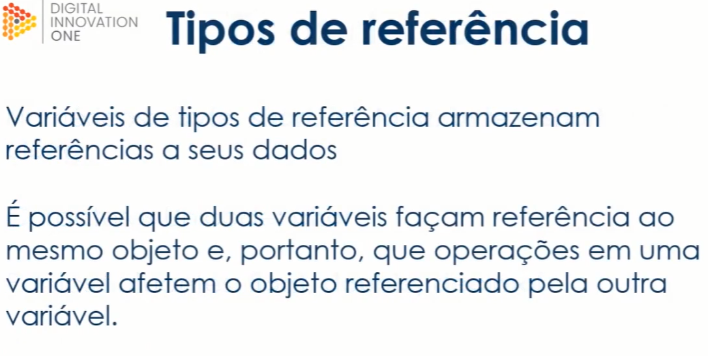

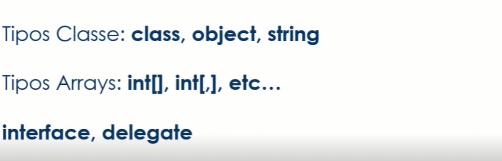


**Utilizando instruções em Programas**

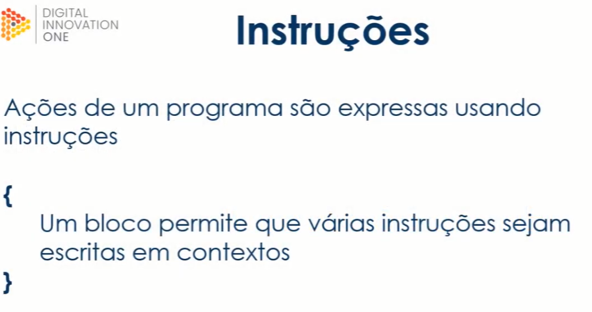

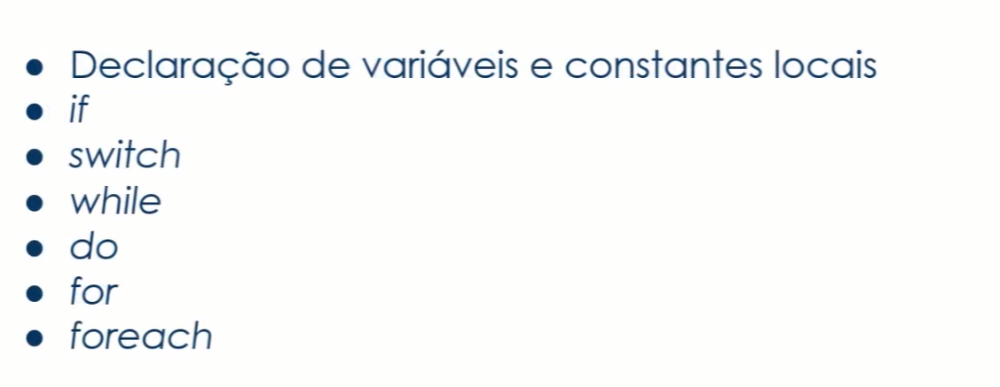

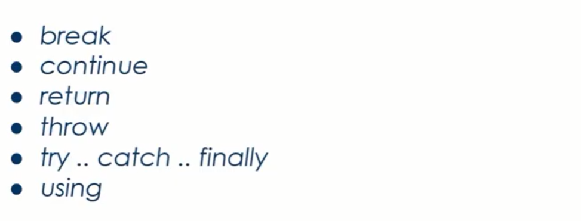

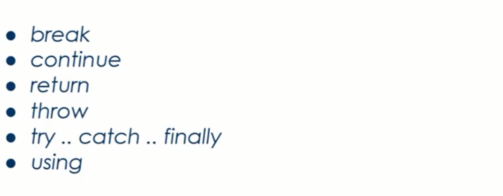


**Exemplificando o Conteúdo**

```csharp
using System;

namespace solution
{
    class Program
    {
        static void Main(string[] args)
        {
             static void Declaracoes()
        {
            int a;
            int b = 2, c = 3;
            const int d = 4;
            a = 1;
            Console.WriteLine(a + b + c + d);
        }

        static void InstrucaoIf(string[] args)
        {
            if (args.Length == 0)
            {
                Console.WriteLine("Nenhum argumento");
            }
            else if (args.Length == 1)
            {
                Console.WriteLine("Um argumento");
            }
            else
            {
                Console.WriteLine($"{args.Length} argumentos");
            }
        }

        static void InstrucaoSwitch(string[] args)
        {
            int numeroDeArgumentos = args.Length;
            switch (numeroDeArgumentos)
            {
                case 0:
                    Console.WriteLine("Nenhum argumento");
                    break;
                case 1:
                    Console.WriteLine("Um argumento");
                    break;
                default:
                    Console.WriteLine($"{numeroDeArgumentos} argumentos");
                    break;
            }
        }

        static void InstrucaoWhile(string[] args)
        {
            int i = 0;
            while (i < args.Length)
            {
                Console.WriteLine(args[i]);
                i++;
            }
        }

        static void InstrucaoDo(string[] args)
        {
            string texto;
            do
            {
                texto = Console.ReadLine();
                Console.WriteLine(texto);
            } while (!string.IsNullOrEmpty(texto));
        }

        static void InstrucaoFor(string[] args)
        {
            for (int i = 0; i < args.Length; i++)
            {
                Console.WriteLine(args[i]);
            }
        }

        static void InstrucaoForeach(string[] args)
        {
            foreach (string s in args)
            {
                Console.WriteLine(s);
            }
        }

        static void InstrucaoBreak(string[] args)
        {
            while (true)
            {
                string s = Console.ReadLine();

                if (string.IsNullOrEmpty(s))
                {
                    break;
                }

                Console.WriteLine(s);
            }
        }

        static void InstrucaoContinue(string[] args)
        {
            for (int i = 0; i < args.Length; i++)
            {
                if (args[i].StartsWith("/"))
                {
                    continue;
                }
                
                Console.WriteLine(args[i]);
            }
        }

        static void InstrucaoReturn(string[] args)
        {
            int Somar(int a, int b)
            {
                return a + b;
            }

            Console.WriteLine(Somar(1, 2));
            Console.WriteLine(Somar(3, 4));
            Console.WriteLine(Somar(5, 6));
            return;
        }

        static void InstrucoesTryCatchFinallyThrow(string[] args)
        {
            double Dividir(double x, double y)
            {
                if (y == 0)
                    throw new DivideByZeroException();

                return x / y;
            }

            try
            {
                if (args.Length != 2)
                {
                    throw new InvalidOperationException("Informe 2 números");
                }

                double x = double.Parse(args[0]);
                double y = double.Parse(args[1]);
                Console.WriteLine(Dividir(x, y));
            }
            catch (InvalidOperationException e)
            {
                Console.WriteLine(e.Message);
            }
            catch (Exception e)
            {
                Console.WriteLine($"Erro genérico: {e.Message}");
            }
            finally
            {
                Console.WriteLine("Até breve!");
            }
        }

        static void InstrucaoUsing(string[] args)
        {
            using (System.IO.TextWriter w = System.IO.File.CreateText("teste.txt"))
            {
                w.WriteLine("Line 1");
                w.WriteLine("Line 2");
                w.WriteLine("Line 3");
            }
        }
        }
    }
}

```

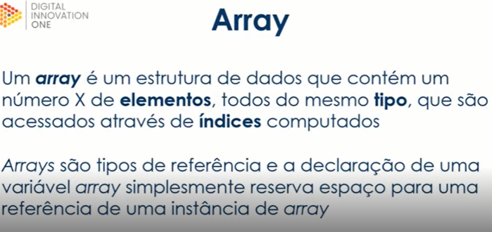

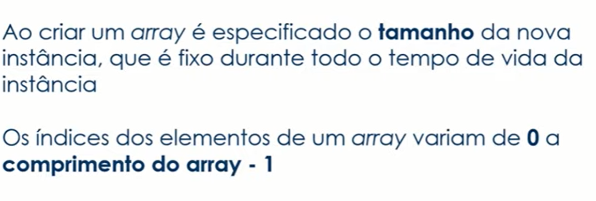

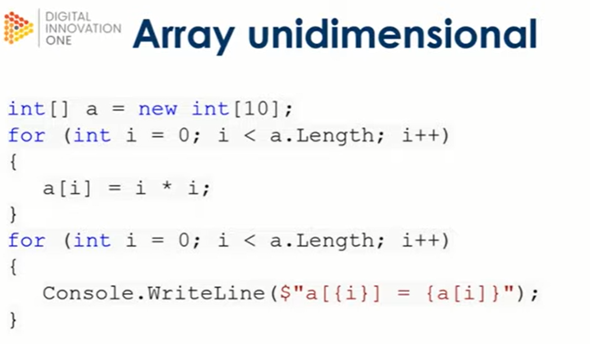

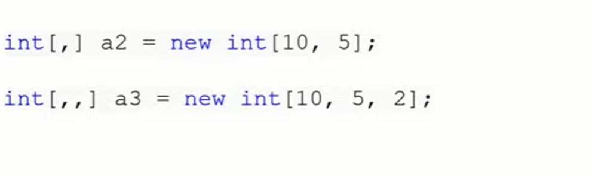

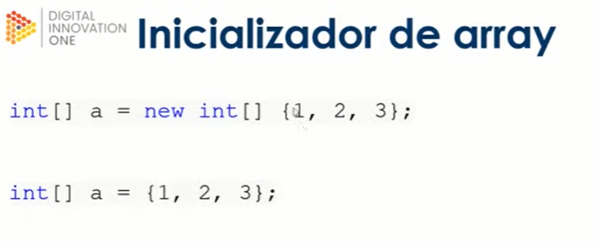

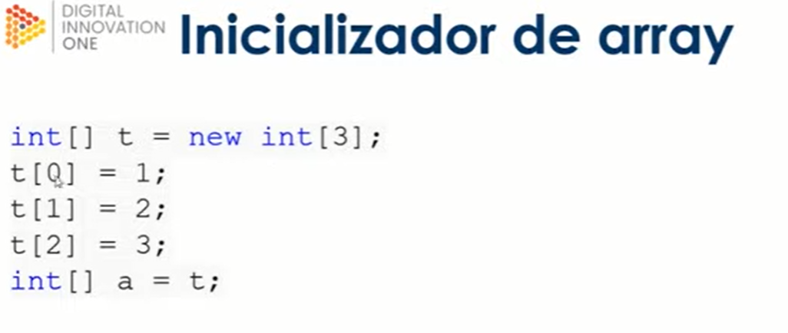

**Questões**

```
Qual destes não é exemplo de um tipo Referência?
interface
enum
string[]
string
object

R: enum
```

```
Qual destes não é exemplo de um tipo Valor?
class
int
char
c. bool
struct

R: class
```

```
O que é correto afirmar sobre variáveis de tipo Referência?
Variáveis de tipos de referência contêm diretamente seus dados.
A alteração de uma variável de tipo referência não afeta outras que tenham copiado seu valor.
As variáveis de tipo referência têm sua própria cópia dos dados e não é possível que as operações afetem outra variável.
Nenhuma das alternativas.
Variáveis de tipos de referência armazenam referências a seus ponteiros direto na memória.

R: Variáveis de tipos de referência armazenam referências a seus ponteiros direto na memória.
```

```
Quais destes são instruções condicionais?
for e while
try e catch
using e declare
break e continue
if e switch

R: if e switch
```

```
Quais destes são instruções para tratativa de exceções?
using e declare
if e switch
try e catch
for e while
break e continue

R: try e catch
```

```
Qual das inicializações de array a seguir é inválida?
string[] a = new int[] {1, 2, 3};
int[] a = {1, 2, 3};
Todas estão corretas.
int[] a = new int[] {1, 2, 3};
int[] a = new int[10];

R: string[] a = new int[] {1, 2, 3};
```

```
Os índices dos elementos de um array começam a ser contados em:
0
-1
Nenhuma das alternativas.
1
null

R: 0
```

```
O que é correto afirmar sobre variáveis de tipo Valor?
Variáveis de tipos de valor armazenam referências a seus dados.
Nenhuma das alternativas.
Variáveis de tipos de valor contêm diretamente seus dados.
É possível que duas variáveis de tipo valor façam referência ao mesmo objeto.
A alteração de uma variável de tipo valor afeta outras que tenham copiado seu valor.

R: Variáveis de tipos de valor contêm diretamente seus dados.
```

```
Qual das afirmações não é verdadeira sobre Arrays?
Arrays são tipos de valor.
Todos os elementos de um array são do mesmo tipo.
Os elementos de um array são acessados através de índices.
Ao criar um array é especificado o tamanho da nova instância, que é fixo durante todo o tempo de vida da instância.
Um array é um estrutura de dados que contém um número X de elementos.

R: Arrays são tipos de valor.
```

```
Quais destes são instruções de repetição?
break e continue
if e switch
using e declare
try e catch
for e while

R: for e while
```

[Voltar ao Índice](#indice)

---


## <a name="parte5">5 - Classes e objetos essenciais em C#</a>


[Voltar ao Índice](#indice)

---


## <a name="parte6">6 - Trabalhando com structs, interfaces e enums</a>


[Voltar ao Índice](#indice)

---


## <a name="parte7">7 - Uma síntese do que é .NET</a>


[Voltar ao Índice](#indice)

---

